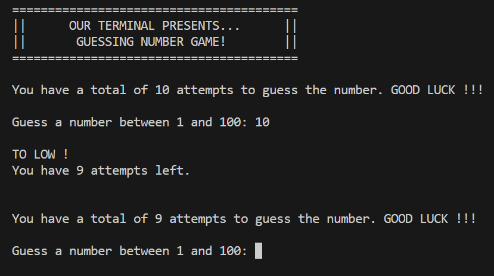
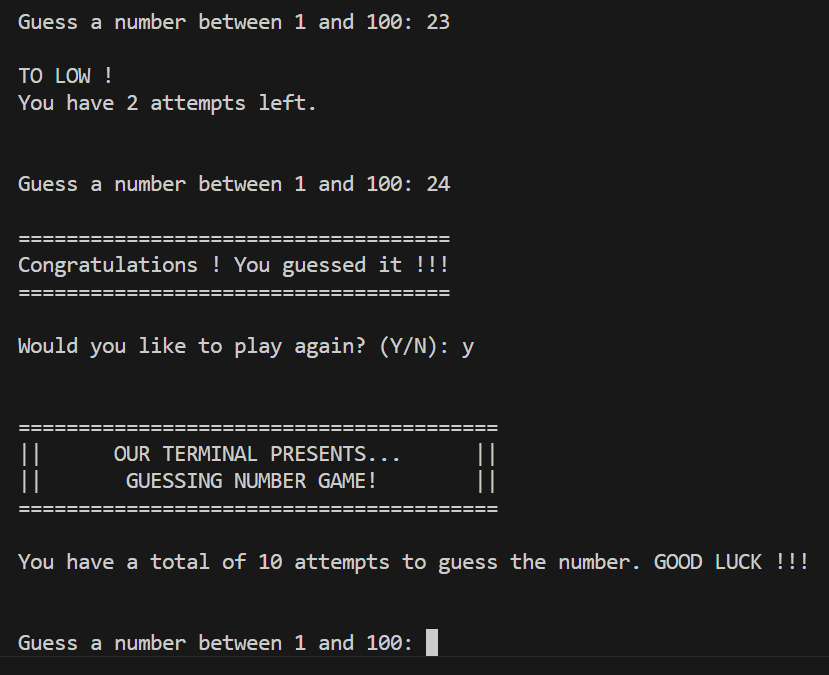
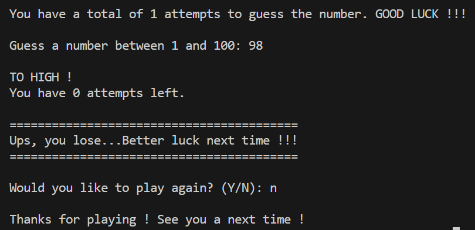

  

# 🔢 Project 7 – Guessing Numbers (in C)

This is **Project 7** in a series of mini exercises for **beginners learning C programming**. Each project helps you build logic, structure, and familiarity with syntax using simple terminal apps.

---

## 📌 About this project

This mini project is a **Guessing Numbers Game**, where the user has 10 attempts to guess a randomly selected number between 1 and 100.

When the program runs, it:

- Displays a banner (from an ASCII `.txt` file)
- Randomly generates a number between 1 and 100
- Prompts the user to guess the number
- Provides feedback if the guess is too high or too low
- Tracks the number of attempts remaining
- Lets the user try again or exit after winning or losing

---

## 🧠 What You’ll Practice

- 🔁 Looping with `for` and `while`
- 🎯 `rand()` and `srand(time(NULL))` for random number generation
- ✅ `bool` flags for game state logic
- 💬 Reusable functions for input/output (`attempt()`, `playAgain()`, etc.)
- 📂 Reading and displaying ASCII banners from a file using `fopen()`, `fgets()`, and `fclose()`

---

## 🖥️ Example Output

📎 Game start:  

📎 Win screen:  

📎 Lose screen:  

---

## 🧠 Challenge Instructions

If you’d like to build this yourself before checking the code, follow these steps:

1. Print an ASCII banner from a `.txt` file.
2. Generate a random number between 1 and 100.
3. Allow the user up to 10 attempts to guess the number on each round.
4. For each guess:
   - Print “TOO HIGH” or “TOO LOW” depending on input.
   - Decrease the number of attempts left.
5. If the number is guessed:
   - Show a win message.
6. If all attempts are used:
   - Show a lose message.
7. After each game, ask if the user wants to play again (`Y/N`).
8. Repeat or exit based on user input.

> **Note:** You can find the ASCII banner in `src/ascii_art.txt`, and example outputs in the `img/` folder.

Happy coding! 🎯🎲
